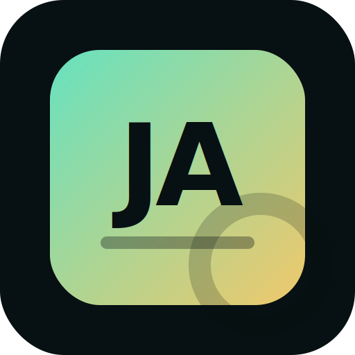

# JobApp AI Assistant

Local-first job application assistant for parsing structured CVs, tailoring applications to job postings, and exporting editable application packages.

Ciencia Vitae exports are a strong reference use case because they are highly structured and include education, professional experience, publications, projects, supervision, events, software, identifiers, and cross-references to research platforms such as ORCID, Scopus, ResearchGate, and Google Scholar.

For a complete practical guide, see [TUTORIAL.md](TUTORIAL.md).

This app can be presented under the broader [d'BiYOK Lab](docs/DBIYOK_LAB.md) idea, a PagBiOmicS initiative for Bring Your Own Key AI-assisted apps across professional productivity, biodiscovery, learning, entrepreneurship, and everyday workflows.



d'BiYOK page materials are kept separately:

- [d'BiYOK Lab concept](docs/DBIYOK_LAB.md)
- [PagBiOmicS page content](docs/PAGBIOMICS_DBIYOK_PAGE_CONTENT.md)
- [Blog post draft](docs/BLOG_POST_DBIYOK_JOBAPP.md)
- [Experimental Web Lite page](docs/jobapp-web-lite.html)

## What It Does

- Parses a local or uploaded CV PDF/TXT into editable JSON-like sections.
- Accepts structured CV sources from the user's computer, including PDF, TXT, and XML.
- Works especially well with structured Ciencia Vitae exports.
- Lets the user include or exclude each CV item before matching a job.
- Places CV focusing before job matching so the AI receives only the evidence the user wants emphasized.
- Exports the parsed CV itself as Markdown, DOCX, PDF, or JSON.
- Exports only selected CV fields when the user wants to manually prepare a focused profile before calling the AI.
- Fetches a job posting URL and fills the job description automatically when the page allows scraping.
- Generates:
  - tailored CV bullets,
  - cover letter,
  - interview preparation,
  - ATS keywords and score estimate.
- Exports each generated application to `exports/` automatically as Markdown.
- Allows one-click export to Markdown, DOCX, and PDF.
- Keeps a local SQLite history of generated applications.

Parsed CV export is local and credit-free. The high-quality parser can use the configured AI provider, but the app also includes a local heuristic parser mode for free tests, structured Ciencia Vitae XML/PDF workflows, and public web demos.

## AI Providers

The app is BYOK-friendly: users can bring their own API key.

Supported provider profiles:

- Google Gemini
- OpenAI / ChatGPT
- Anthropic Claude
- Custom OpenAI-compatible API
- Local OpenAI-compatible server
- Ollama local
- DeepSeek
- GLM / Zhipu AI

Local providers can run without an API key when they expose an OpenAI-compatible `/chat/completions` endpoint.

## Recommended Local Workflow

For non-technical users, the preferred distribution is the desktop executable: double-click `JobApp-AI-Assistant-Windows.exe`, the app starts a local server, and the browser opens automatically.

For development:

```powershell
cd path\to\JobApp-AI-Assistant
python -m pip install -r requirements.txt
python -m uvicorn jobapp_ai_assistant:app --host 127.0.0.1 --port 8091
```

Then open:

```text
http://127.0.0.1:8091/
```

The app may also run on `8080`, but that port can be occupied by other local services on the workstation.

## Desktop Distribution

Windows build:

```powershell
cd path\to\JobApp-AI-Assistant
powershell -ExecutionPolicy Bypass -File .\build_exe.ps1
```

Output:

```text
dist\JobApp-AI-Assistant-Windows.exe
```

For distribution, share only `dist\JobApp-AI-Assistant-Windows.exe`. Do not bundle local `data/`, `exports/`, `applications.db`, or API configuration files. On first run, the app creates its own local data folders next to the executable on the user's computer.

The launcher prefers `localhost:8080`; if that is busy, it tries `8090`, `8091`, `8000`, and then a free port from `8100+`.

macOS `.dmg` is a future release target. It should be built on macOS or through a GitHub Actions macOS runner, not from this Windows workstation.

To generate a local PDF guide next to the executable:

```powershell
powershell -ExecutionPolicy Bypass -File .\build_readme_pdf.ps1
```

Linux and macOS users can fork the repository or run it locally with Python:

```bash
git clone <repository-url>
cd JobApp-AI-Assistant
python -m pip install -r requirements.txt
python -m uvicorn jobapp_ai_assistant:app --host 127.0.0.1 --port 8091
```

## CV Parsing Workflow

1. Use **Choose CV from PC** or **Import CV from local drive** to upload a PDF/TXT/XML CV through the file explorer.
2. Select **AI parser** when a configured API key or local LLM is available.
3. Select **Heuristic parser** for a free local parse that avoids LLM/API credits.
4. Use **Open last parsed CV** to reuse the app's local CV memory instead of importing the same file repeatedly.
5. Use Step 2 to include or exclude publications, projects, experience, software, or other sections before matching.
6. Export either:
   - the full parsed CV,
   - only the selected fields,
   - or the final tailored application package after matching a job.

The parsed export intentionally uses the structured data, not the raw Ciencia Vitae PDF headers. This removes repeated page headers, footer noise, and Portuguese platform labels where the parser has already translated the content into English.

The detailed parsed CV editor is intentionally placed after the main workflow so large academic CVs do not push job matching and final exports too far down the page.

## Provider Setup Tutorial

1. Open the app.
2. Go to **AI Engine**.
3. Select a provider.
4. Paste the API key if the provider requires one.
5. Set the model and base URL.
6. Click **Save engine**.
7. Click **Test connection**.

Direct provider help:

- Gemini API key: <https://ai.google.dev/gemini-api/docs/api-key>
- Google AI Studio: <https://ai.google.dev/aistudio>
- OpenAI API keys: <https://platform.openai.com/api-keys>
- Claude API keys: <https://console.anthropic.com/settings/keys>
- Ollama local API: <https://docs.ollama.com/api>

For local Ollama:

```text
Provider: Ollama local
Base URL: http://localhost:11434/v1
Model: llama3.1 or another installed Ollama model
API key: leave empty
```

For a local OpenAI-compatible server, such as the one used in Clean&Merge:

```text
Provider: Local OpenAI-compatible server
Base URL: http://localhost:8081/v1
Model: local-model
API key: leave empty unless your server requires one
```

## PagBiOmicS Web Roadmap

This repository is currently a localhost version. The safest PagBiOmicS web strategy is to offer two routes and explain the trade-offs clearly:

- **Run locally, recommended:** download the app, run it on localhost, and enter API keys only on the user's computer.
- **Run from the web, experimental:** possible for low-risk workflows or demos, but it must warn users about API-key trust, browser risks, and data sensitivity.

The initial public web page should be a landing/download page that explains the workflow and sends users to the desktop app. An experimental Web Lite page is included for public or anonymized tests only.

- Downloadable Windows executable first.
- Mac `.dmg` later, ideally built on macOS or GitHub Actions.
- BYOK inside the local app for private work; Web Lite is only for public, anonymized, or low-risk tests.
- Free local tools: heuristic parsing and parsed-CV exports without AI credits.
- Email capture for updates, tutorials, and release notifications.
- Newsletter signup for job-search, bioinformatics, omics, and scientific-career resources.
- Optional sponsor placements from biotech, omics, scientific software, training providers, recruiters, or job boards.

The web version must be designed carefully around privacy: CVs, job postings, and API keys are sensitive data.

An embeddable HTML prototype is included in [pagbiomics_embed.html](pagbiomics_embed.html). It is a landing/download block with a link to the experimental Web Lite page.

- It links users to the desktop release.
- It explains that private API keys and sensitive CV work belong in the local desktop app.
- It links directly to Gemini/AI Studio/Ollama setup pages.
- It links to Web Lite only as a low-risk browser experiment.

Future paid/API-hosted/Web3 ideas are tracked in [CHANGELOG.md](CHANGELOG.md), not exposed as current web options.

Near-term monetization without direct payments:

- email-gated release notifications and newsletter growth,
- sponsored placements from biotech, omics, scientific software, or training providers,
- job board partnerships,
- premium consulting/CV review services outside the automated app.

## Notes

- LinkedIn and some platforms may block scraping. In that case, paste the job text manually.
- Localhost mode is the safest default for private CV work.
- The generated outputs are starting points and should be reviewed before submission.
